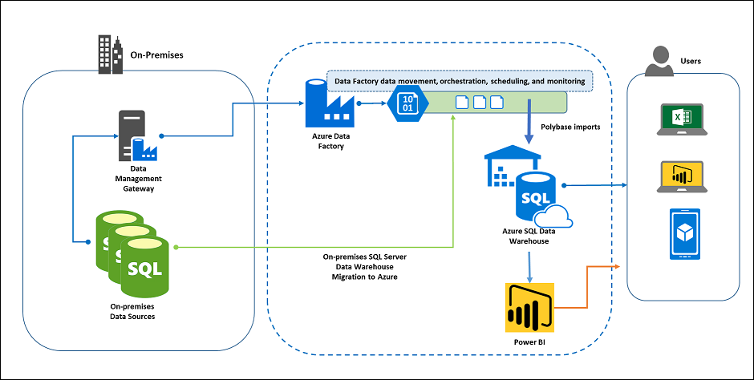

Coho has asked you to migrate an existing on-premises SQL Server data warehouse to Azure SQL Data Warehouse. To build out a viable solution that can replace the existing functionality of the on-premises system you will need to setup and configure an Azure SQL Data Warehouse, validate and migrate the existing data warehouse schema and data to Azure SQL Data Warehouse, configure an Azure Data Factory pipeline to move data from an on-premises system to Azure SQL Data Warehouse and configure Power BI to access the Azure SQL Data Warehouse.

**Time Estimate:** 5.0 hours