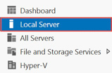
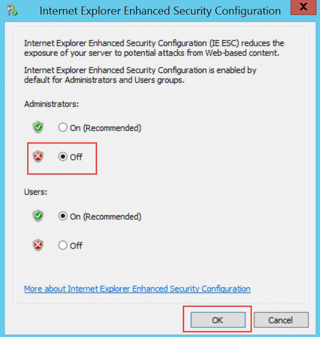
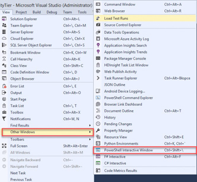
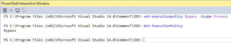
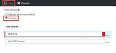

## **Exercise 0:** Environment setup

**Overview:** In this exercise you will create a lab machine if necessary and deploy the source environment for this workshop. 

**Prerequisites:**
  * Microsoft Azure subscription: [Azure Registration](./01_Azure_Registration.md)
  * Client computer with Windows 7 or later with Visual Studio 2017 

### **Task 1:** Setup a Development Environment

!!<h4>Create VM</h4>If you do not have a machine setup with Visual Studio 2017 Community and Azure SDK 2.9+ you will need to complete this task.

1.	Create a virtual machine in Azure using the latest release of Visual Studio Community 2017. 
    * It is highly recommended to use a DS2_V2 or D2_V2 instance size for this VM


### **Task 2:** Disable IE Enhanced Security

!!<h4>Note</h4>Sometimes this image has IE ESC disabled, sometimes it does not.

1.	On the new VM you just created click the Server Manager icon.


2.  Click Local Server 


3.	On the right side of the pane, click **On** by IE Enhanced Security Configuration. 


4.	Change to **Off** for Administrators and click **OK**.


### **Task 3:** Validate Connectivity to Azure

1.	From within the virtual machine, Launch Visual Studio 2017 and validate that you can login with your Microsoft Account when prompted. 

2.	Validate connectivity to your Azure subscription. Launch Visual Studio, open Server Explorer from the View menu, and ensure that you can connect to your Azure subscription. 


### **Task 4:** Deploy the ARM template

1.	From within your lab machine, create a new folder named **C:\workshop**

2.	Download the ARM template from [https://cloudworkshop.blob.core.windows.net/migrate-edw/Migating%20EDW%20to%20the%20Cloud%20workshop%20-%20Student-Files-6-2017.zip](https://cloudworkshop.blob.core.windows.net/migrate-edw/Migating%20EDW%20to%20the%20Cloud%20workshop%20-%20Student-Files-6-2017.zip) and extract to C:\workshop.

3.	Right-click the zip file, select properties, check the **Unblock** checkbox and click **OK**.


4.	Open the C:\Hackathon\Migating EDW to the Cloud workshop - Student-Files\Templates\EnvironmentSetup\EnvironmentSetup.sln in Visual Studio

5.	Open **PowerShell Interactive Window** within Visual Studio.


6.	Run below commands to set PowerShell execution policy to bypass

```PowerShell
set-executionpolicy Bypass -Scope Process
```



7.	In the Solution Explorer pane, under the EnvironmentSetup solution, right-click the EnvironmentSetup project, navigate to **Deploy -> New…**

8.	In the Deploy to Resource Group window, update the following:

    1. Subscription: **Choose the subscription you are using for your workshop**

    2. Resource group: **Create a new resource group called DWEnvironment and select a location that is near you.** Be aware that there is a limit to the number of cores per region available to you. Consider using another region if you already have resources deployed in your nearest region.

    3. Deployment template: **azuredeploy.json**

    4. Template parameters file: **azuredeploy.parameters.json**

    5. Click the **Edit Parameters** button.

        * AdminUserName: **demouser**
        * AdminPassword: **demo@pass123**
        * dcipDnsName: **create a unique name**
        * SQLsalesIPDnasName: **create a unique name**
        * SQLwarehouseIPDnsName: **create a unique name**
    
    6. Artifact storage account: **\<Automatically create a storage account\>**
    
    
 	 
9.	Click on **OK**.

### **Task 5:** Configure DNS and join the domain

1.	Browse to the Azure Portal and authenticate at [https://portal.azure.com/](https://portal.azure.com/)

2.	Navigate to the **DWEnvironment** resource group and select the **cohovnet** virtual network. 


3.	On the settings pane select **DNS servers**, then select **Custom DNS** on the DNS servers blade. Type **10.0.0.10** for the Primary DNS server then click the **Save** button.


4.	Wait for the configuration change to complete before continuing.

5.	Navigate back to your **DWEnvironment** resource group and select the **SQLCohoDW** virtual machine.


6.	On the **SQLCohoDW** virtual machine blade, click the **restart** button, then click **yes** to restart the virtual machine.


7.	Repeat steps 4 and 5 to restart the **SQLCohoSales** virtual machine.


8.	Navigate back to the **SQLCohoDW** virtual machine and once **SQLCohoDW** has finished rebooting, connect to it using your **demouser** admin account.


9.	Once logged into **SQLCohoDW**, navigate to Server Manager, then click on **Local Server**, then click **WORKGROUP**.


10.	On the Computer Name tab, click the **Change** button.


11.	Make this virtual machine a member of the **coho.com** domain then click OK.


12.	Use **demouser** and **demo@pass123** for the domain administrator account, then click **OK**, **Close**, **Restart Now** to reboot the computer.

13.	Repeat steps 8 through 12 on the **SQLCohoSales** virtual machine to join **SQLCohoSales** to your domain.