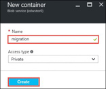
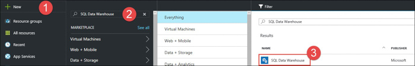
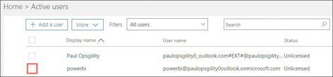
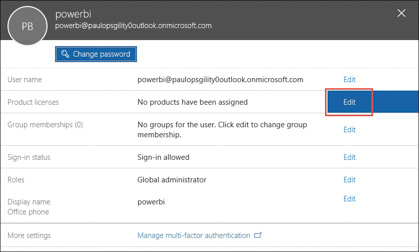
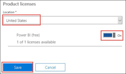

## **Exercise 1:** Configure Azure services

**Overview:** In this exercise, you will create and configure an Azure SQL Data Warehouse, an Azure Storage Account, and a Power BI Account.

### **Task1:** Create an Azure Storage Account

1.	Browse to the Azure Portal and authenticate at [https://portal.azure.com/](https://portal.azure.com/)

2.	Click **+New** and type **Storage account** in the search box.  Choose **Storage account** from the results.

3.	Click **Create** on the Storage account blade.  Specify the following information and click **Create**.
    * Name: **specify a unique DNS name**
    * Deployment model: **Resource manager**
    * Account kind: **General purpose**
    * Performance: **Standard**
    * Replication: **Locally-redundant storage (LRS)**
    * Storage encryption: **Disabled**
    * Secure transfer required: **Disabled**
    * Resource group: **Create new - EDWmigrationStor**
    * Location: **Location near you**

4.	Navigate to the new storage account and click **Blobs**.

5.	On the Blob service blade Click the **+Container** button.

6.	On the New container blade type **migration** for the name and then click **Create**.

### **Task 2:** Create an Azure SQL Data Warehouse

1.	Click **+New** and type **SQL Data Warehouse** in the search box.  Choose **SQL Data Warehouse** from the results.

2.	Click **Create** on the SQL Data Warehouse blade.  Specify the following information and then click the **Server** tile.
    * Name: **CohoDW** 
    * Resource group: **Create new - CohoDWRG**
    * Performance: **100**

3.	On the Server blade, select **Create a new server**, specify the following options and click **Select**.
    * Server name: **Choose a unique name**
    * Server admin login: **demouser**
    * Password: **demo@pass123**
    * Location: **Same location as your source**
    * Allow azure services: **checked**

4.	On the SQL Data Warehouse blade click **Create**.

### **Task 3:** Create an Azure Data Factory

1.	From the Azure Portal, click new and type Data Factory into the search box.

2.	Choose Data Factory from the search results.

3.	Click **create** on the information blade.

4.	On the new data factory blade, give your data factory a unique name, create a new resource group called **CohoDF**, and choose the location nearest to you. 

5.	Click **Create** to deploy your Data Factory.

### **Task 4:** Create a Power BI Pro account

1.	Note that these steps describe creating an account that can be enabled for a Power BI Pro trial from within an Azure Pass subscription or MSDN subscription. If you are using an organizational account for this hackathon some of these steps may be unnecessary or impossible depending on your level of access. If your existing account is already enabled for Power BI Pro then you may skip this task.

2.	Open a browser and navigate to the Azure Portal at [http://portal.azure.com](http://portal.azure.com)

3.	Navigate to **Azure Active Directory**.

4.	If you have multiple subscriptions, you will need to choose the correct Azure Active Directory Tenant. By default, your tenant is called **default directory**.

5.	Once you have determined the correct AD tenant, click on **Users and groups**. 

6.	Click on the **All users** tile.

7.	At the bottom of the users screen, click on the **+New user** button.

8.	Fill in the configurations per the below instructions and then click **Create**.
    * Name: PowerBI User
    * User name: Choose a username, this will require you to specify the domain. By default this domain will be **\<name of your subscription\>.onmicrosoft.com**
    * Profile: Configure the profile
    * Properties: Leave the default 
    * Groups: Leave the default 
    * Directory Role: **Global administrator**
    * Password: **Copy the password**, you will login and change this later.	 

9.	Open a new **InPrivate** browser and login to [http://portal.azure.com](http://portal.azure.com). You will be prompted to change your password.

10.	After changing your password, navigate to the Office 365 admin center at [https://portal.office.com/admin/default.aspx](https://portal.office.com/admin/default.aspx)

11.	If required, **update your admin contact info**.

12.	On the navigation pane, expand **Billing** and click **Subscriptions**.

13.	Click the **+ Add subscriptions** button.

14.	Scroll down to Other Plans, and find **Power BI (free)** and hover over the **ellipses** at the bottom.

15.	Click the **Buy now** button.

16.	Click on **checkout**, accept the defaults and fill out the remaining billing information and **choose to be invoiced for the bill**. The total should be $0.00.

17.	Click on **assign users to your new subscription**.

18.	Check the box next to the account you created.

19.	Click **Edit** Product licenses.

20.	Set the **location** to your location, set the Power BI (free) switch to **On**, then click **Save**.

21.	Close all of the account editor windows.

22.	Navigate to [http://powerbi.com](http://powerbi.com) and click **Sign in**. If you are prompted for additional sign-in then enter your sign-in if necessary. If you are prompted to invite more people, choose **skip**. This should bring you to the Power BI Service. Later in this hackathon you will enable the trial for Power BI Pro.

## Summary
In this exercise, you configured your Azure services in preparation for your warehouse environment migration. You configured an Azure Storage account to temporarily store your data before importing, you then created an Azure SQL Data Warehouse which you will use as a migration target and finally you created a Power BI account which you will use to integrate and modernize your data warehouse environment.