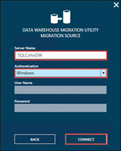
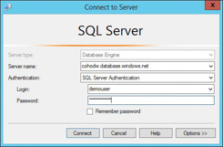
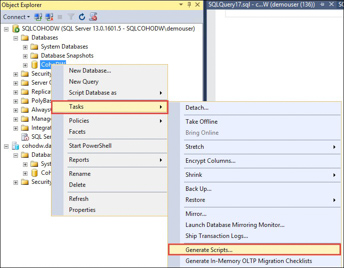
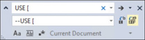

## **Exercise 2:** Data and schema preparation

**Overview:** Coho is relying on you to migrate the data warehouse to Azure SQL Data Warehouse. One of the most important steps is preparing the data and schema. During this phase you will need to verify compatibility of the schema and data and make any necessary changes required for a successful migration.

### **Task 1:** Check compatibility with the Data Warehouse Migration Utility (Preview)

1.	In the Azure portal, navigate to your **DWEnvironment** resource group, then connect to the **SQLCohoDW** virtual machine.

2.	Download the [Data Warehouse Migration Utility](https://docs.microsoft.com/en-us/azure/sql-data-warehouse/sql-data-warehouse-migrate-migration-utility) (Preview) and extract the contents.


!!<h4>Note</h4>If you get an internet explorer message ‘Your current security settings do not allow this file to be downloaded’, Go to Internet explorer Menu -> Internet Options -> Security Tab -> Click on Internet -> Select Custom Level -> Select ‘Enable’ in Downloads\File Download section.

3.	Run the Windows Installer file and follow the steps to install the Data Warehouse Migration Utility.

4.	Open the Data Warehouse Migration Utility by double-clicking the icon on your desktop.


5.	The Data Warehouse Migration Utility will open on the source and destination selection window. Review the source and destination. Notice that the Data Warehouse Migration Utility supports migrations from SQL Server and Azure SQL Database. Make sure that Source Type is set to **SQL Server** then click **Next**.


6.	On the Migration Source window, change the Server Name to **SQLCohoDW**, set Authentication to Windows, and then click **Connect**.


7.	Select the **CohoDW** database and then click the Check Compatibility button. 


8.	Choose an output location for your compatibility report and click the **Save** button. In the File Saved Successfully popup choose **No**.

!!<h4>NOTE</h4>You will not be able to open the compatibility report on the server as it does not have Excel installed.

9.	Open the file location that your report was saved (by default it will be in your My Documents folder) and copy and paste the file to your local machine.

10.	Open the file on your local machine to review the output (your output may be different than what you see below). 


!!<h4>NOTE</h4>The Data Warehouse Migration Utility is currently in preview and the feature-set is incomplete and may have additional issues such as false negatives. It can be used to easily automate the migration of smaller databases but be aware that it does not compress files, move data to Azure storage or use Polybase for import.

### **Task 2:** Validate schema and data

1.	In the Azure portal, navigate to your **DWEnvironment** resource group, then connect to the **SQLCohoDW** virtual machine.

2.	Launch SQL Server Management Studio and open a **New Query** window.


3.	Run the following query to check for data incompatibility and potential data length issues.

```SQL
USE CohoDW
GO
SELECT t.[name] as [Table], 
       c.[name] as [Column], 
       c.[system_type_id], 
       c.[user_type_id], 
       y.[is_user_defined], 
       y.[name]
FROM sys.tables  t JOIN sys.columns c ON t.[object_id] = c.[object_id]
                   JOIN sys.types y ON c.[user_type_id] = y.[user_type_id]
WHERE y.[name] IN ('geography', 'geometry', 'hierarchyid', 'image', 'ntext',
'numeric', 'sql_variant', 'sysname', 'text', 'timestamp', 'uniqueidentifier', 'xml')
  OR (y.[name] IN ('varchar', 'varbinary') AND ((c.[max_length] = -1) or 
                                              (c.max_length > 8000)))
  OR (y.[name] IN ('nvarchar') AND ((c.[max_length] = -1) or 
                               (c.max_length > 4000))) OR y.[is_user_defined] = 1;
```

!!<h4>NOTE</h4> A full list of incompatible table features and data types can be found in the migration documentation at [https://azure.microsoft.com/en-us/documentation/articles/sql-data-warehouse-overview-migrate/](https://azure.microsoft.com/en-us/documentation/articles/sql-data-warehouse-overview-migrate/)

4.	The output of the query shows the table and column but not the reason for the incompatibility. To gain more insight into the reason you can script the table out by expanding the CohoDW database in Object Explorer, right-click the table, select Script Table as -> CREATE To -> New Query Editor Window.


5.	From the script of the table you can see that the ‘TSQL’ column of the ‘DataLog’ table has a data type nvarchar(4000) which is equivalent to 8000 bytes which means that the data may potential exceed the maximum data size.


6.	Before we fix this column we must validate that none of the data would be truncated. Check the maximum actual data size with the following query.

```SQL
SELECT MAX(DATALENGTH([TSQL]))
FROM DatabaseLog
```

    * The result is 3034 which means that our longest value is 3034 bytes or 1517 characters, leaving us plenty of space to modify the column with no loss of data.

7.	Modify the column by executing the following query:

```SQL
ALTER TABLE dbo.DatabaseLog ALTER COLUMN [TSQL] nvarchar(2000)
```

### **Task 3:** Prepare Azure SQL Data Warehouse and migrate schema

1.	In the Azure portal, navigate to your **DWEnvironment** group, then connect to the **SQLCohoDW** virtual machine.

2.	Open Internet Explorer and connect to the Azure Portal.

3.	Navigate to your CohoDWRG resource group, then click on the cohodw logical SQL Server that hosts your Azure SQL Data Warehouse.


4.	In the settings blade, click on **Firewall**.

5.	In the cohodw - Firewall blade, click the **+Add client IP** button, then click the **Save** button.


6.	Back in the **CohoDWRG** resource group, select the **CohoDW** data warehouse and copy the server name.


7.	Open SQL Server Management studio, click the connect button in Object Explorer and connect to your SQL Data Warehouse using the **demouser** account and password to verify connectivity.


8.	On your Azure SQL Data Warehouse, expand databases, select the CohoDW database then click the **New Query** button.

9.	Connect to the local SQLCohoDW instance of SQL Server, right click your local copy of CohoDW, and select **Tasks -> Generate Scripts** to launch the Generate and Publish Scripts wizard.


10.	Click Next on the Introduction screen.

11.	On the Choose Objects screen, **Select the Select specific database objects** radio button and check **Tables**, then click Next.


12.	On the Set Scripting Options screen. Select the **Save to Clipboard** radio button and click Next.


13.	Accept the defaults for the remaining screens and click **Finish**.

14.	Paste the results into the Query windows connected to your Azure SQL Data Warehouse.

15.	This script still needs to be modified before it will run correctly in Azure SQL Data Warehouse because some T-SQL syntax is not supported in Azure SQL Data Warehouse. Make the following updates to the script:
    * Execute a Find and Replace on your script to replace all occurrences of “ON [PRIMARY]” with “” to remove them from the script.


    * Execute a Find and Replace on your script to replace all occurrences of “USE [” with “--USE [” to comment out those lines.


    * Execute a Find and Replace on your script to replace all occurrences of “SET ANSI_PADDING” with “--SET ANSI_PADDING” to comment out those lines.


16.	Run the script by clicking the Execute button. This will use the default options to create tables, Clustered Columnstore Indexing and ROUNDROBIN distribution. 


17.	Execute the following query to verify that your tables were created. There should be 33 rows returned.

```SQL
SELECT * FROM sys.tables
```

## Summary
In this exercise, you prepared and verified your schema with a combination of the Data Warehouse Migration Utility and T-SQL scripts to analyze the schema and data. You then scripted your database, made the necessary changes and applied your script to Azure SQL Data Warehouse.