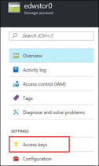
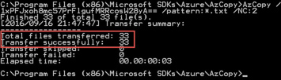
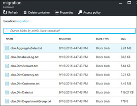

## **Exercise 3:** Migrate the data to Azure SQL Data Warehouse

**Overview:** This exercise is focused on migrating the data from your existing data warehouse into SQL Data Warehouse. We will be pulling the data and then uploading it to an Azure storage account. We will then import the data via Polybase.

### **Task 1:** Exporting data from your current data warehouse.

1.	Connect to your **SQLCohoDW** virtual machine.

2.	Open the **C:\Hackathon\bcp_commands.txt** file. These are the bcp commands for each of the tables you need to migrate. The line below is an example. Notice the bcp commands all use the -C 65001 parameter. This indicates that the output will be in UTF-8 which is required by Polybase. This code page is only an option with bcp.exe that ships with SQL Server 2016 tools. If you are using an older version of bcp you will have an additional step to convert to UTF-8.

```PowerShell
bcp "select [ScenarioKey],REPLACE([ScenarioName],'|','||') from [CohoDW].[dbo].[DimScenario]" queryout "C:\Migration/dbo.DimScenario.txt" -q -c -C 65001 -t "|" -r "\n" -S SQLCohoDW -T
```

3.	Close the file after you are done reviewing it. Change the file name to **bcp_commands.bat**.


4.	Open a command prompt and execute **C:\Hackathon\bcp_commands.bat**

!!<h4>Note</h4> In a production environment you would likely make some effort to parallelize the execution of the various bcp commands. For larger tables, you also might parallelize the export from a single table.

5.	Navigate to the **C:\Migration** folder. If the commands completed successfully you will have **33 files**.


### **Task 2:** Transfer your data to Azure

1.	From your SQLCohoDW virtual machine navigate to you C:\Hackathon folder and double-click **MicrosoftAzureStorageTools.msi** to install AzCopy.

2.	In the Azure Portal navigate to your **EDWmigrationStor** resource group and click on your storage account.

3.	In the Storage account blade, under settings, click on **Access keys**


4.	Copy the storage account name and access key1 and paste into notepad for later use.


5.	Open a command prompt and navigate to the **C:\Program Files (x86)\Microsoft SDKs\Azure\AzCopy** folder.

6.	Update the following command with your storage account name and key then execute it to begin copying your data files to Azure (all of the text is a single command)

```PowerShell
AzCopy /Source:"C:\Migration" /Dest:https://<YourStorageAccount>.blob.core.windows.net/migration /DestKey:<YourStorageAccountKey> /pattern:*.txt /NC:2
```

7.	Confirm that all 33 files were transferred successfully.


    * Confirm that the files are in the correct storage container by navigating to your storage account, clicking on blobs, then clicking on your container.


8.	Open SQL Server Management Studio and connect to your SQL Data Warehouse.

9.	Open a new query window and execute the following command to create a master key for your database.

```SQL
CREATE MASTER KEY
```

10.	Execute the following to create a database scoped credential that you will use to store the access key to the migration storage account.

```SQL
CREATE DATABASE SCOPED CREDENTIAL MigrationCredential
WITH IDENTITY = '<YourStorageAccountName>' , SECRET = '<YourStorageAccountKey>'
```

11.	Create an external file format by executing the following query. The external file format defines the external storage and its layout.

```SQL
CREATE EXTERNAL DATA SOURCE MigrationStor WITH (TYPE = HADOOP ,
LOCATION=
'wasbs://<YourStorageContainerName>@<YourStorageAccountName>.blob.core.windows.net',
CREDENTIAL = MigrationCredential);
```

12.	Create an external file format by executing the following query. The external file format defines the external storage and its layout.

```SQL
CREATE EXTERNAL FILE FORMAT MigrationFiles WITH(FORMAT_TYPE = DelimitedText,
FORMAT_OPTIONS (FIELD_TERMINATOR = '|'));
```

13.	Open the C:\Hackathon\CreateExternalTables.sql file in SQL Server Management Studio.

14.	This file contains all of the external table definitions for our tables and directly leverages the external data source and external file format we created above. Click Execute to create the external tables.


15.	Run the following code to verify that 33 tables were created.

```SQL
SELECT * FROM SYS.TABLES WHERE is_external = 1
```

16.	We are about to load the warehouse. We would like to maximize performance of the load. To do this we will adjust the performance of the Azure SQL Data Warehouse by adjusting the scale slider in the Azure Portal. Navigate to your CohoDW SQL Data Warehouse and click on the Scale button.


17.	In the Scale blade, adjust the Performance slider to 300 and click the Save button.


18.	Wait until the scaling process is complete to move on to the next step. You can view the SQL Data Warehouse status in the portal. The status will change from “Scaling” to “Online” and the Performance tier will reflect 300 DWUs when scaling is complete.


19.	From your **SQLCohoDW** virtual machine, open the C:\Hackathon\LoadData.sql file in SQL Server Management Studio.

20.	The commands in this file insert data extracted directly from the data files stored in Azure Storage via the external tables we defined in the previous steps. Click execute to begin the data load.


21.	After your data is uploaded you can select data from any of the tables to verify success. In production environments, you would go through a much more thorough data validation process.

!!<h4>IMPORTANT!</h4>**Scale your SQL Data Warehouse back down to 100 to prevent excessive cost.**