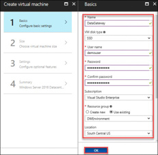
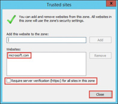
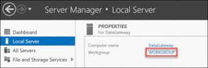
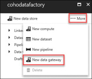
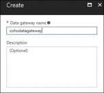
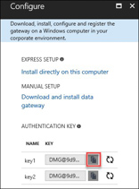

## **Exercise 4:** Integrate Azure SQL Data Warehouse and On-Premises Data Sources with Azure Data Factory and Power BI

**Overview:** In this portion of the exercise, you will setup integration with Azure Data Factory and Power BI.

!!<h4>Note</h4>To connect Power BI dashboards and reports directly to Azure SQL Data Warehouse requires a Power BI Pro subscription. Please see the instructions earlier in this hackathon to configure an account for Power BI and enable a Power BI Pro trial if you do not already have one.

### **Task 1:** Connect Power BI to Azure SQL Data Warehouse

1.	Connect to the Azure Portal and to your Azure SQL Data Warehouse.

2.	Make note of your server name to use in your data source configuration later in this task.

3.	Open a web browser and navigate to [**powerbi.com**](https://powerbi.microsoft.com) and click **Sign in** in the upper right corner of the screen. 

4.	Sign in with the organizational account that you are using to access Power Bi Pro.

5.	Click on the **Get Databases** button. 

6.	On the **Get Data > Databases & More** screen, click on **Azure SQL Data Warehouse** the click **Connect**. If you are presented with a message to indicating that you need Power BI Pro, click the option to enable the trial and a Power BI Pro trial will be started for this account.

7.	Supply your Azure Data Warehouse server details:

8.	Provide the Azure SQL Data Warehouse credentials: **demouser** and **demo@pass123**

9.	It will take 1 to 2 minutes to load the data.

10.	Once added the CohoDW SQL Data Warehouse will be shown under My Workspace > Datasets. Click on the CohoDW dataset.

11.	In PowerBI, in the Fields blade, expand the **SalesByRegion** table and check the box next to **StateProvinceCode**. This will automatically launch the map visualization because PowerBI is smart enough to understand that this is geographic data.

12.	The circles that PowerBI adds to the map are simply every state or province in which Coho had sales. Let’s add the sales amount to this to make the map a little more interesting. Add the **SalesAmount** from the **SalesByRegion** table by putting a check next to it. The circles on the map will change in size to reflect the sum of all sales in that particular State/Province.

13.	Click the **Save** button in the top right of your screen, name your report **Sales by state** and click **Save**.

### **Task 2:** Configure a Data Management Gateway machine to enable on-premises data sources with Data Factory.

1.	Open the Azure Portal and navigate to your DWEnvironment resource group where you deployed your “on-premises” environment.

2.	In the DWEnivronment blade, click the **Add+** button.

3.	In the search field type **Windows Server 2016** and hit enter, then choose **Windows Server 2016 Datacenter** from the results.

4.	On the Windows Server 2016 Datacenter blade click **Create**.

5.	On the Create virtual machine Basics blade, fill in the following information and then click **OK**:
    * Name: **DataGateway**
    * VM disk type: **SSD**
    * Username: **demouser**
    * Password: **demo@pass123**
    * Resource Group: **Use existing - DWEnvironment**
    * Location: **Same location you used for this deployment**

6.	On the Create virtual machine, Choose a size blade, select **DS2_v2** and click **Select**. 

!!<h4>Note</h4>If the DS2_v2 size is not visible you may need to select View All to see it.

7.	On the Create virtual machine Settings blade, configure the following settings, take the defaults for any settings not defined here, then click **OK**:
    * Virtual network: **cohovnet**
    * Subnet: **Identity**

8.	On the Create virtual machine Summary blade, click **OK** to begin the deployment of your Data Management Gateway machine.

9.	Wait for the virtual machine to deploy before proceeding.

10.	Once the virtual machine deployment has succeeded, connect to **DataGateway** using your **demouser** admin account.

11.	Once logged into **DataGateway**, open Internet Explorer, click **Settings**, then choose **Internet Options**.

12.	Click the Security tab, click on **Trusted sites**, and then click the **Sites** button.

13.	On the Trusted sites window, uncheck the **Require server verification (https:) for all sites in this zone** checkbox, then add **microsoft.com** to the trusted site zone, then click **Close**.

14.	Click **OK**, then close Internet Explorer.

15.	Navigate to Server Manager, click on **Local Server**, then click on **IE Enhanced Security Configuration**.

16.	Set IE Enhanced Security Configuration to **Off** for Administrators, then click **OK**.

17.	From within Server Manager, navigate to **Local Server**, then click **WORKGROUP**.

18.	On the Computer Name tab, click the **Change** button.

19.	Make this virtual machine a member of the **coho.com** domain then click **OK**.

20.	Use **COHO\demouser** and **demo@pass123** for the domain administrator account, then click **OK**, **Close**, **Restart Now** to reboot the computer.

21.	After the computer has rebooted, connect to **DataGateway using your **demouser** admin account.

22.	Open Internet Explorer, and navigate to the Azure Portal.

23.	Navigate to your Azure Data Factory that you created earlier.

24.	Click the **Author and deploy** tile.

25.	On the Data Factory Editor, click **…More**, then select **New data gateway**.

26.	Give your gateway a unique name and click **OK**.

27.	Click **Install directly on this computer** under Express Setup. This will launch the ClickOnce installation. Note that if you are using a browser other than Internet Explorer the install may not work correctly. If you are using Google Chrome you can install the ClickOnce plugin from the Chrome web store. Alternatively you may use the manual installation and register your Gateway with the key provided. 

28.	After the install completes, copy the **authentication key** and then click **OK**.

29.	From your DataGateway machine, launch the **Microsoft Data Management Gateway Configuration Manager** and verify that your data gateway is connected to your cloud service.

30.	Register your gateway by clicking the Register link. Paste the data gateway authentication key into the box and click Register.

31.	Test your data management gateway by clicking on the Diagnostics tab, choose SqlServer for the data source type, sqlcohosales for the server, CohoSales for the database, Windows for the authentication mode, demouser for the user name and demo@pass123 for the password.

32.	From your DataGateway machine, go back to the Azure Portal and navigate to your Data Factory Editor. 
33.	Click the New data store button and choose SQL Server from the list.

34.	Modify the existing JSON, replacing the placeholder values with the appropriate ConnectionString, gatewayName, username and password. You should set Integrated Security to True. Your JSON should look similar to the following:

35.	Click the Encrypt button to launch the Credentials Manager application and encrypt the Credentials. If you are using the Chrome browser this may not work without a ClickOnce extension installed.

36.	After the Credentials Manager pops up, change the authentication to Windows Authentication, set the username to demouser and the password to demo@pass123 then click OK.

37.	Credentials Manager will encrypt your credentials, the result should look similar to this in your JSON document.

38.	Click the Deploy button to deploy your SQL Server Linked Server.

39.	Go back to the Data Factory Overview and click the Copy data tile to launch the copy data wizard.

40.	On the Properties page, set the Task name to CohoSalesPipeline, and set the schedule to Run once now.

!!<h4>Note</h4>In a production scenario, you would schedule this pipeline to run on a recurring schedule based on business requirements but for our purposes a one-time copy will be sufficient.

41.	On the Source data store page, click the From Existing Connections tab, then select the SqlServerLinkedService. 

42.	Click Next on the Connection properties page.

43.	On the Select tables page, select Sales.SalesOrderHeader and Sales.SalesTerritory tables and click Next.

44.	On the Destination data store page, select Azure SQL Data Warehouse and click Next.

45.	Specify the Azure SQL Data Warehouse configuration for your Azure SQL Data Warehouse.

46.	Accept the defaults on the Table mapping page and click Next.

47.	Accept the defaults on the Schema mapping page and click Next.

48.	On the Performance settings page, you will specify a storage account that will be used to stage your data before Data Factory copies the data using Polybase. Specify a New connection, change the connection name to CohoStagingStorage, and choose the storage account you used during your migration for the storage account name.

49.	The summary page will give you a diagram and the configuration of what you are about to build. Click Next to initiate the deployment.

50.	After the deployment completes, wait about 5 minutes then click on the Click here to monitor copy pipeline link.

51.	Click on each of the pipelines in the lower pane of dashboard. Scroll down on the right pane to see status of the pipeline and the metrics from execution.

52.	Open Internet Explorer and navigate to powerbi.com and click Sign in in the upper right corner of the screen. 

53.	Sign in with the organizational account that you are using to access Power Bi Pro.

54.	Expand My Workspace, click the ellipses next to your dataset and choose remove. 

55.	Click the ellipses next to your Azure SQL Data Warehouse dashboard and remove it.

56.	Click on the Get Data link in the lower left corner of the screen.

57.	Setup a new connection to your Azure SQL Data Warehouse.

58.	If your new connection and dataset do not show up after the import, you may need to refresh your browser.

59.	Expand My Workspace and click on your dataset.

60.	Scroll down through your list of fields and you should now see the SalesOrderHeader and SalesTerritory tables that we imported using Azure Data Factory.

61.	On the visualizations blade click the pie-chart icon.

62.	On the Fields blade, expand the SalesOrderHeader table and put a check next to ∑ TotalDue, expand SalesTerritory and put a check next to Name.

63.	Drag the OrderDate field from the SalesOrderHeader table to the Report level filters.

64.	Change the Filter Type to Advanced filtering, set the following values and then click Apply filter:
    * Show items when the value: is on or after
    * Date: 2014-06-30
    * Time: 12:00AM
    * And: is before
    * Date: 2014-07-01
    * Time: 12:00AM

65.	Click save and save your report with the name Sales by Region 6-30-2014

## Summary
In this exercise, you have configured Power BI to connect directly to an Azure SQL Data Warehouse. You then deployed an Data Management Gateway to enable access to on-premises data sources from Azure Data Factory. You created a Copy Data pipeline in Azure Data Factory to update data in Azure SQL Data Warehouse. Finally, you created a new Power BI report to leverage the new data in your Azure SQL Data Warehouse.